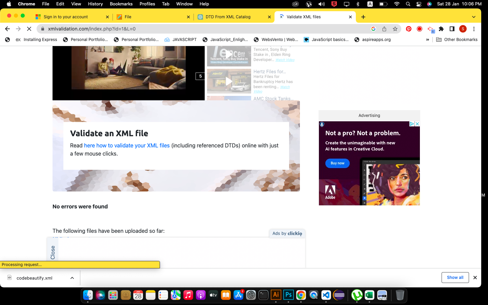

Answer 1: 

Answer 1 (Validation): 

Answer 2: 

Answer 3. DTD (Document Type Definition) is used in XML to define the structure and elements of an XML document. It specifies the rules for the markup language, including the element names, attributes, and hierarchy. The key features of using DTD in XML are:
1. Validation: DTD allows for validation of XML documents against a set of predefined rules, ensuring that the document is well-formed and conforms to the structure specified in the DTD.
2. Reusability: DTD can be reused across multiple XML documents, making it easy to maintain consistency and reduce errors.
3. Simplifies development: DTD allows developers to create a structure, which can be reused easily.

XSD (XML Schema Definition) is a language used to define the structure, elements, and data types of an XML document. It serves a similar purpose as DTD (Document Type Definition), but provides more advanced features and capabilities.
Some of the key purposes of XSD include:
1. Validation: XSD allows for validation of XML documents against a set of predefined rules, ensuring that the document is well-formed and conforms to the structure specified in the XSD.
2. Data typing: XSD allows for the definition of data types for elements, such as integer, string, date, etc. This allows for better validation and processing of the data in the XML document.
3. Namespaces: XSD supports the use of namespaces, which allows for the definition of elements and attributes from different sources in a single schema.
4. Extensibility: XSD allows for the definition of custom data types and the ability to extend existing types, making it more flexible and powerful than DTD.
5. Better support for data modeling: XSD provides more advanced mechanisms for modeling data, including support for complex types, attributes, and substitution groups.

In Summary, XSD (XML Schema Definition) is a more advanced and powerful language than DTD (Document Type Definition) for defining the structure, elements, and data types of an XML document. XSD provides better support for data validation, data typing, and namespaces. It also allows for the definition of custom data types and the ability to extend existing types, making it more flexible and useful for larger, more complex XML documents. Additionally, XSD allows for better support for data modeling and extensibility, making it a more versatile choice than DTD.

